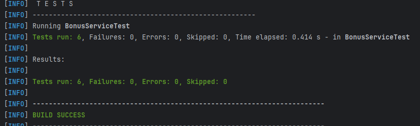

# Проведение автотестов и сборки программы расчета бонуса за покупку

_Цель_: создание своего первого Maven-проекта, создание и запуск автотестов на JUnit5;

_дополнительно_: использование плагина _maven-checkstyle-plugin_ с имитацией применения недопустимого наименования
переменной, заведение баг-репорта и создание фикс-коммита

# Входные данные:

* сумма платежа
* бонус для зарегистрированного пользователя 3% от суммы покупки
* бонус для незарегистрированного пользователя 1% от суммы покупки
* лимит бонусов 500 рублей

_В автотесты включены следующие тестовые сценарии_:

* зарегистрированный пользователь, сумма покупки > лимита бонусов

* зарегистрированный пользователь, сумма покупки < лимита бонусов

* незарегистрированный пользователь, сумма покупки > лимита бонусов

* незарегистрированный пользователь, сумма покупки < лимита бонусов

* незарегистрированный пользователь, сумма покупки точно соответствует лимиту бонусов

* зарегистрированный пользователь, сумма покупки незначительно выше лимита бонусов

# Выходные данные:

Проведено 6 автотестов, 0 ошибок.

Успешная сборка.

mvn clean test

